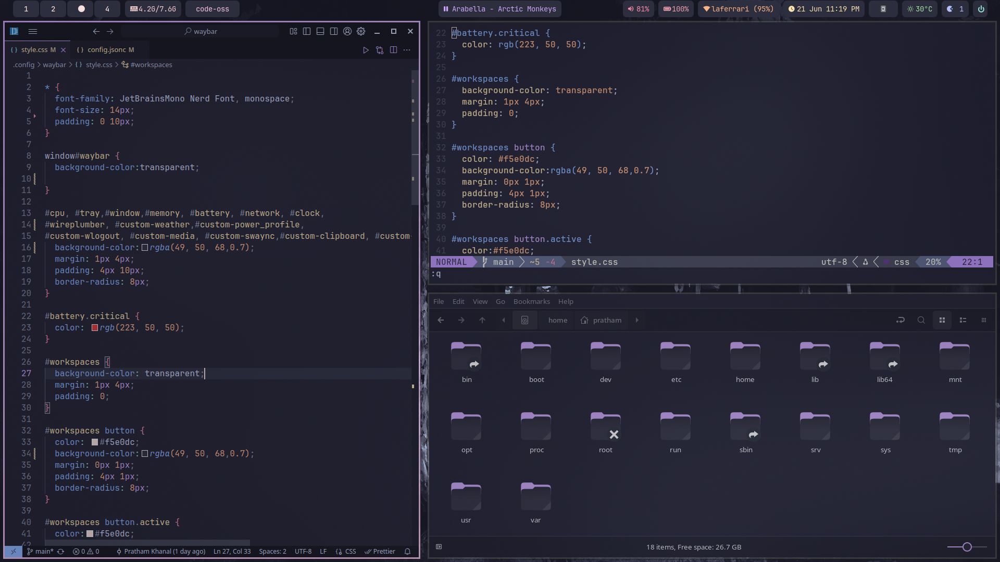

# My dotfiles
Based on the catppuccin-mocha.

## INSTALLATION
to install the config automatically you need to install [Stow](https://archlinux.org/packages/extra/any/stow/)
and run stow package_name  for example, "stow waybar" if that doesn't work you can do it manually,

## Waybar weather config
add your openweathermap api key in the ~/.config/waybar/scripts/weather.sh 

## for website themes
[Stylus Firefox](https://addons.mozilla.org/en-US/firefox/addon/styl-us/) 
[Stylus Chrome](https://chromewebstore.google.com/detail/clngdbkpkpeebahjckkjfobafhncgmne?utm_source=item-share-cb) 
use this addon and you can find the ports in the official [catppuccin](https://catppuccin.com/ports/) website 

## Screenshots

